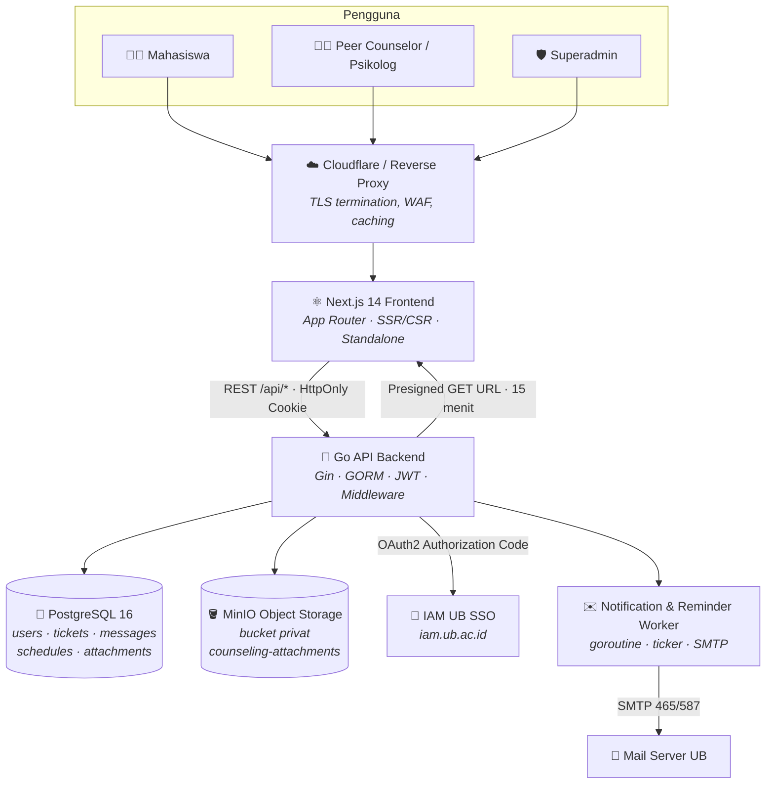

<div align="center">

# Layanan Konseling Mahasiswa Universitas Brawijaya

**Modern, Secure, and Integrated Peer Counseling & Psychological Support Platform**

[](https://nextjs.org/)
[](https://www.typescriptlang.org/)
[](https://tailwindcss.com/)
[](https://go.dev/)
[](https://www.postgresql.org/)
[](https://min.io/)
[](https://www.docker.com/)
[](https://owasp.org/)

</div>

---

## 📖 Gambaran Umum Proyek

**Layanan Konseling Mahasiswa Universitas Brawijaya** adalah platform konseling
sebaya (*peer counseling*) dan pendampingan psikologis berbasis web yang
memodernisasi sistem *ticketing* lama (osTicket) menjadi sebuah sistem
interaktif yang terintegrasi penuh dengan **SSO IAM Universitas Brawijaya**.

Sistem lama menuntut mahasiswa mengelola akun terpisah, menyajikan antarmuka
yang kaku, dan tidak memberi konselor alat kerja yang memadai untuk memantau
beban kasus maupun jadwal sesi. Platform ini menggantinya dengan portal
mahasiswa yang ringkas, dasbor konselor yang informatif, serta jalur komunikasi
yang terenkripsi dan terjaga kerahasiaannya.

### Sasaran

- Menyediakan wadah yang **aman, rahasia, dan mudah diakses** bagi mahasiswa
  untuk memperoleh pendampingan psikologis.
- Menghubungkan mahasiswa dengan **Peer Counselor (Konselor Sebaya)** dan
  **Psikolog Profesional** tanpa hambatan administratif.
- Memberi konselor dan pengelola layanan **visibilitas data** yang diperlukan:
  antrean tiket, jadwal sesi, riwayat klien, dan tren topik permasalahan.
- Menghapus friksi autentikasi: satu identitas UB, tanpa kata sandi tambahan.

---

## 🏛️ Diagram Arsitektur Sistem



<details>
<summary><b>Versi diagram blok (ASCII)</b></summary>

```
   Mahasiswa            Peer Counselor            Superadmin
       │                       │                       │
       └───────────────┬───────┴───────────────────────┘
                       ▼
        ┌──────────────────────────────────────┐
        │  Cloudflare / Reverse Proxy (HTTPS)  │
        └──────────────────┬───────────────────┘
                           ▼
        ┌──────────────────────────────────────┐
        │      Next.js 14 Frontend (App Router)│
        └──────────────────┬───────────────────┘
                           │  REST /api/*  (HttpOnly Secure Cookie)
                           ▼
        ┌──────────────────────────────────────┐
        │        Go API Backend (Gin)          │
        │  Auth │ Ticket │ Schedule │ Upload   │
        │  Middleware: JWT · CORS · RateLimit  │
        └───┬────────┬────────┬────────┬───────┘
            │        │        │        │
            ▼        ▼        ▼        ▼
     PostgreSQL   MinIO    IAM UB   SMTP Worker
        16      (privat)    SSO     (goroutine)
```

</details>

---

## 📂 Struktur Direktori Monorepo

```
peer-conselour-web/
├── .agents/                      # Aturan & konteks kerja untuk agen AI
│   └── AGENTS.md
│
├── peer-conselour-app/           # ── FRONTEND (Next.js 14) ──────────────
│   ├── app/                      # App Router
│   │   ├── _portal/              #   Komponen & util bersama portal
│   │   ├── admin/                #   Dasbor admin, tiket, mahasiswa, akun
│   │   ├── auth/                 #   Auth provider & context sesi
│   │   ├── tickets/[id]/         #   Detail tiket + ruang chat
│   │   ├── my-counseling/        #   Riwayat konseling mahasiswa
│   │   ├── berita/               #   Direktori berita kampus
│   │   ├── psikoedukasi/         #   Materi psikoedukasi
│   │   └── styles/               #   CSS modular per domain
│   ├── src/
│   │   ├── utils/api.ts          #   SINGLE SOURCE OF TRUTH konfigurasi API
│   │   ├── components/           #   Komponen base & application
│   │   └── hooks/                #   Custom React hooks
│   ├── public/                   # Aset statis
│   └── Dockerfile
│
├── peer-conselour-be/            # ── BACKEND (Go + Gin) ─────────────────
│   ├── cmd/api/main.go           # Entry point & registrasi route
│   ├── config/                   # Env loader + koneksi GORM
│   ├── internal/
│   │   ├── handler/              #   auth · ticket · schedule · user · upload
│   │   ├── model/                #   Entitas GORM
│   │   ├── repository/           #   Lapisan akses data
│   │   ├── notification/         #   Dispatch email asinkron
│   │   └── worker/               #   Reminder berjenjang H+1/H+3/H+5/H+7
│   ├── middleware/               # JWT auth · CORS whitelist · rate limit
│   ├── pkg/
│   │   ├── email/                #   SMTP mailer & komposisi email tiket
│   │   ├── jwt/                  #   Sign & verify token
│   │   ├── media/                #   Magic bytes · resize · WebP encode
│   │   └── storage/              #   MinIO client & presigned URL
│   ├── templates/email/          # Template email HTML (go:embed)
│   ├── .env.example              # Referensi variabel (placeholder saja)
│   └── Dockerfile
│
├── docker-compose.yml            # Orkestrasi backend + frontend + MinIO
├── .gitignore
└── README.md
```

---

## ✨ Fitur Utama Platform

### 🎓 Portal Mahasiswa

- **Pembuatan tiket konseling interaktif** dengan pemilihan topik permasalahan
  dan jenis layanan (tatap muka / online).
- **Formulir data terintegrasi SSO** — identitas, NIM, fakultas, dan program
  studi terisi otomatis dari IAM UB.
- **Ruang percakapan *live-like*** dengan konselor: kirim, sunting, dan hapus
  pesan, lengkap dengan lampiran berkas.
- **Riwayat konseling** lengkap beserta status tiket dan jadwal sesi.
- **Materi psikoedukasi** dan **direktori berita kampus** sebagai kanal
  informasi preventif.
- **Penutupan tiket mandiri** ketika mahasiswa merasa persoalannya selesai.

### 🧑‍⚕️ Admin & Peer Counselor Dashboard

- **Manajemen tiket & delegasi konselor** — penugasan, perubahan status, dan
  pemantauan antrean.
- **Jadwal konseling interaktif** dengan kalender dan alur status
  (`pending_confirmation` → `scheduled` → `completed` / `reschedule` / `cancelled`).
- **Rekapitulasi data mahasiswa**: profil klien dan seluruh riwayat tiketnya.
- **Grafik analitik topik permasalahan** berbasis Recharts, dengan paginasi
  kartu dan area scroll dinamis agar tetap ringkas di layar kecil.
- **Manajemen akun konselor** dengan hak khusus Superadmin (pembuatan, edit,
  reset kata sandi).

### 🔐 Keamanan & Privasi Tingkat Lanjut

| Lapisan | Implementasi |
| --- | --- |
| Autentikasi | Murni **IAM UB SSO** (OAuth2 Authorization Code). Tanpa login lokal publik. |
| Penyimpanan sesi | **JWT di HttpOnly + Secure + SameSite cookie** — tidak terbaca JavaScript, sehingga token tidak dapat dicuri lewat XSS. Request dikirim dengan `credentials: "include"`. |
| Proteksi CSRF | **Dynamic `state` parameter** disimpan di cookie `oauth_state` (TTL 300 s) dan divalidasi saat callback. |
| Sanitasi konten | **DOMPurify** membersihkan seluruh pesan chat HTML hasil migrasi osTicket sebelum dirender. |
| Validasi unggahan | Deteksi tipe asli via **Magic Bytes** (512 byte pertama, `http.DetectContentType`) — ekstensi & `Content-Type` klien tidak dipercaya. |
| Akses berkas | **Presigned GET URL** berlaku 15 menit dari bucket MinIO privat, dengan validasi kepemilikan lampiran. |
| Jaringan | **CORS origin whitelist** + **rate limiting global** (20 req/s, burst 40). |
| Hardening | Rute `dev-login` hanya terdaftar saat `APP_ENV=development`; port internal di-bind ke `127.0.0.1`. |

### 🖼️ Media & File Pipeline

- Unggahan dibatasi **10 MB** per berkas.
- Format diizinkan: **PDF, DOC, DOCX, JPEG, PNG, WEBP**.
- Gambar melebihi **2048px** otomatis di-*resize*, lalu dikonversi ke
  **WebP kualitas 82%** oleh backend Go sebelum disimpan.
- Nama objek di MinIO selalu **UUID v4** acak — mencegah *directory traversal*
  dan kebocoran nama berkas asli.
- Bucket `counseling-attachments` **privat**, tidak pernah diekspos publik.

### 📬 Asynchronous Notification

- Dispatch email berjalan di **goroutine terpisah** sehingga tidak memblokir
  respons HTTP.
- **Background worker** berbasis `time.Ticker` mengirim **reminder berjenjang
  H+1, H+3, H+5, H+7** untuk tiket yang belum ditanggapi konselor.
- Template **HTML email** (`templates/email/`) di-*embed* ke binary via
  `go:embed`: tiket dibuat, balasan pertama konselor, sesi ditutup, dan
  empat tingkat reminder.
- **Guardrail development**: `EMAIL_DEV_MODE=true` mengalihkan seluruh email ke
  satu alamat pengembang agar mahasiswa asli tidak pernah menerima email uji.

---

## 🛠️ Teknologi yang Digunakan

### Frontend

| Teknologi | Versi | Peran |
| --- | --- | --- |
| Next.js | 14.2 (App Router) | Framework React, SSR/CSR, output `standalone` |
| React | 18.3 | Library UI |
| TypeScript | 5.7 | Type safety (mode strict) |
| Tailwind CSS | v4 | Styling utility-first |
| Lucide React | 0.511 | Ikon |
| Recharts | 3.x | Grafik analitik dasbor |
| Motion (Framer Motion) | 12.x | Animasi deklaratif |
| GSAP | 3.12 | Animasi timeline lanjutan |
| DOMPurify | 3.4 | Sanitasi HTML chat |
| React Aria Components | 1.x | Komponen aksesibel (date picker, input) |

### Backend

| Teknologi | Versi | Peran |
| --- | --- | --- |
| Go | 1.22+ (toolchain repo: `go 1.26.4`) | Bahasa utama |
| Gin Web Framework | 1.12 | HTTP router & middleware |
| GORM | 1.31 | ORM PostgreSQL + AutoMigrate |
| golang-jwt/jwt | v5 | Penerbitan & verifikasi JWT |
| disintegration/imaging | 1.6 | Resize gambar |
| chai2010/webp | 1.4 | Encoder WebP |
| MinIO Go SDK | v7 | Klien object storage & presigned URL |
| google/uuid | 1.6 | Nama objek acak |
| joho/godotenv | 1.5 | Pemuat berkas `.env` |

### Database & Storage

| Teknologi | Peran |
| --- | --- |
| PostgreSQL 16 | Basis data relasional utama (dengan ENUM types kustom) |
| MinIO | Object storage S3-compatible untuk lampiran konseling |

### DevOps & Tooling

| Teknologi | Peran |
| --- | --- |
| Docker & Docker Compose | Orkestrasi lokal dan staging |
| Git | Kontrol versi, Conventional Commits |
| aaPanel / Plesk | Hosting backend & frontend di lingkungan UB |

---

## 🚀 Panduan Instalasi & Menjalankan Lokal

### Prasyarat

| Kebutuhan | Versi minimum |
| --- | --- |
| Node.js | 18+ (disarankan 20 LTS) |
| Go | 1.22+ |
| PostgreSQL | 16 |
| MinIO Server | Terbaru (atau jalankan lewat Docker Compose) |
| Docker & Docker Compose | Opsional, untuk jalur containerized |

Buat basis data kosong terlebih dahulu — skema dibangun otomatis oleh GORM
`AutoMigrate` saat backend pertama kali dijalankan:

```bash
createdb peer_counseling
```

### Langkah 1 — Setup Backend (Go)

```bash
cd peer-conselour-be
cp .env.example .env
# Konfigurasikan variabel di .env (DB, IAM, JWT, MinIO, SMTP)
go mod download
go run cmd/api/main.go
```

Backend berjalan di `http://localhost:8080`. Verifikasi cepat:

```bash
curl http://localhost:8080/api/ping
# {"message":"pong","status":"backend active"}
```

### Langkah 2 — Setup Frontend (Next.js)

```bash
cd peer-conselour-app
npm install
npm run dev
```

Frontend berjalan di `http://localhost:3000`.

> **Penting:** aktifkan baris development di `src/utils/api.ts` agar frontend
> menunjuk ke backend lokal:
>
> ```ts
> export const BASE_URL = "http://localhost:8080";
> // export const BASE_URL = "https://api-konseling.ub.ac.id";
> ```

### Alternatif — Menjalankan via Docker Compose

```bash
docker compose up --build -d
```

Layanan yang dijalankan:

| Service | Port | Keterangan |
| --- | --- | --- |
| `frontend` | `3000` | Next.js standalone |
| `backend` | `127.0.0.1:8080` | Go API (bind localhost saja) |
| `minio` | `127.0.0.1:9000` / `9001` | Object storage + konsol web |

Tetapkan kredensial MinIO lewat environment host sebelum menjalankan
(`docker-compose.yml` tidak menyimpan kredensial nyata):

```bash
export MINIO_ROOT_USER="your_minio_user"
export MINIO_ROOT_PASSWORD="your_minio_password"
export MINIO_SERVER_URL="http://localhost:9000"
```

Memantau dan menghentikan:

```bash
docker compose logs -f backend
docker compose down
```

---

## ⚙️ Panduan Konfigurasi Environment

> ⚠️ **Seluruh nilai di bawah adalah placeholder.** Kredensial sebenarnya hanya
> boleh berada di `peer-conselour-be/.env` (di-ignore Git) dan password manager
> tim. Jangan pernah meng-commit nilai asli.

### Backend — `peer-conselour-be/.env`

Salin dari `peer-conselour-be/.env.example`.

#### Aplikasi

| Variabel | Contoh | Keterangan |
| --- | --- | --- |
| `PORT` | `8080` | Port HTTP backend |
| `APP_ENV` | `development` | `development` / `production`. Nilai `development` mengaktifkan rute `dev-login`. |
| `FRONTEND_URL` | `http://localhost:3000` | Tujuan redirect setelah callback SSO |

#### Database (PostgreSQL)

| Variabel | Contoh | Keterangan |
| --- | --- | --- |
| `DB_HOST` | `localhost` | Host PostgreSQL |
| `DB_PORT` | `5432` | Port PostgreSQL |
| `DB_USER` | `postgres` | Pengguna database |
| `DB_PASSWORD` | `your_secure_db_password` | **Rahasia** |
| `DB_NAME` | `peer_counseling` | Nama database |
| `DB_SSLMODE` | `disable` | `disable` lokal, `require` di production |

#### IAM UB SSO (OAuth2)

| Variabel | Contoh | Keterangan |
| --- | --- | --- |
| `IAM_CLIENT_ID` | `your_iam_client_id` | Client ID aplikasi di IAM UB |
| `IAM_CLIENT_SECRET` | `your_iam_client_secret` | **Rahasia** |
| `IAM_REDIRECT_URI` | `http://localhost:8080/api/auth/callback` | Harus identik dengan yang terdaftar di IAM |
| `IAM_URL_AUTHORIZE` | `https://iam.example.ac.id/.../auth` | Endpoint otorisasi OIDC |
| `IAM_URL_ACCESS_TOKEN` | `https://iam.example.ac.id/.../token` | Endpoint tukar token |
| `IAM_URL_USERINFO` | `https://iam.example.ac.id/.../userinfo` | Endpoint profil pengguna |

#### JWT

| Variabel | Contoh | Keterangan |
| --- | --- | --- |
| `JWT_SECRET` | `your_32_character_jwt_secret_key` | **Rahasia**, minimal 32 karakter |
| `JWT_EXPIRATION_HOURS` | `24` | Masa berlaku cookie sesi |

#### MinIO Object Storage

| Variabel | Contoh | Keterangan |
| --- | --- | --- |
| `MINIO_ENDPOINT` | `localhost:9000` | Host:port MinIO |
| `MINIO_ACCESS_KEY` | `your_minio_access_key` | **Rahasia** |
| `MINIO_SECRET_KEY` | `your_minio_secret_key` | **Rahasia** |
| `MINIO_BUCKET_NAME` | `counseling-attachments` | Bucket **privat** |
| `MINIO_USE_SSL` | `false` | `true` bila MinIO di balik HTTPS |

#### SMTP & Notifikasi Email

| Variabel | Contoh | Keterangan |
| --- | --- | --- |
| `SMTP_HOST` | `mail.example.ac.id` | Host SMTP |
| `SMTP_PORT` | `465` | `465` (TLS langsung) atau `587` (STARTTLS) |
| `SMTP_SECURE` | `true` | `true` untuk port 465 |
| `SMTP_USER` | `noreply@example.ac.id` | Akun pengirim |
| `SMTP_PASSWORD` | `your_smtp_password` | **Rahasia** |
| `SMTP_FROM_NAME` | `"Layanan Konseling UB"` | Nama tampilan pengirim |
| `SMTP_FROM_EMAIL` | `noreply@example.ac.id` | Alamat pengirim |
| `EMAIL_ENABLED` | `false` | Saklar utama pengiriman email |
| `EMAIL_DEV_MODE` | `true` | Mengalihkan **semua** email ke `EMAIL_DEV_OVERRIDE_TO` |
| `EMAIL_DEV_OVERRIDE_TO` | `developer@example.com` | Penerima tunggal saat dev mode |
| `EMAIL_LINK_BASE_URL` | `http://localhost:3000` | Basis URL tautan di dalam email |

### Frontend — `peer-conselour-app/src/utils/api.ts`

Frontend **tidak** menggunakan berkas `.env` untuk konfigurasi API. Seluruh
pengaturan terpusat di satu berkas sebagai *single source of truth*:

| Konstanta | Nilai development | Nilai production |
| --- | --- | --- |
| `BASE_URL` | `http://localhost:8080` | `https://api.example.ac.id` |

Peralihan environment dilakukan dengan menukar komentar pada dua baris
`export const BASE_URL` di berkas tersebut.

### Docker Compose — environment host

| Variabel | Default (placeholder) | Keterangan |
| --- | --- | --- |
| `MINIO_ROOT_USER` | `counseling_admin` | Pengguna root MinIO |
| `MINIO_ROOT_PASSWORD` | `minio_change_this_password` | **Wajib diganti** sebelum dipakai |
| `MINIO_SERVER_URL` | `http://localhost:9000` | URL publik MinIO |

---

## 📦 Panduan Deployment Singkat

### Backend (Go) — aaPanel / Linux Server

Bangun binary statis tanpa dependensi C:

```bash
cd peer-conselour-be
CGO_ENABLED=0 GOOS=linux go build -o server cmd/api/main.go
```

Unggah `server`, direktori `templates/`, dan berkas `.env` (dengan
`APP_ENV=production`) ke server, lalu jalankan sebagai service yang dikelola
supervisor aaPanel atau `systemd`.

Checklist pra-deploy:

- [ ] `APP_ENV=production` → rute `dev-login` tidak terdaftar.
- [ ] `DB_SSLMODE=require`.
- [ ] `MINIO_USE_SSL=true` dan bucket berstatus privat.
- [ ] Origin production sudah masuk whitelist `middleware/cors_middleware.go`.
- [ ] `EMAIL_DEV_MODE=false` hanya setelah alur email diverifikasi.
- [ ] Port `8080` tidak diekspos langsung ke internet (gunakan reverse proxy).

### Frontend (Next.js) — Node.js Server / Plesk

```bash
cd peer-conselour-app
npm ci
npm run build          # menghasilkan output standalone (.next/standalone)
npm run start          # atau: node .next/standalone/server.js
```

Sebelum build, pastikan `BASE_URL` di `src/utils/api.ts` menunjuk ke API
production. Letakkan aplikasi di balik reverse proxy dengan TLS aktif — cookie
sesi ber-flag `Secure` sehingga **wajib** diakses melalui HTTPS.

### Containerized (Docker Compose)

```bash
docker compose up --build -d
```

---

## 🤝 Standar Kontribusi

### Format Commit — Conventional Commits

```
<type>: <ringkasan imperatif dalam Bahasa Inggris>
```

| Type | Penggunaan |
| --- | --- |
| `feat:` | Fitur baru |
| `fix:` | Perbaikan bug |
| `refactor:` | Perubahan struktur tanpa mengubah perilaku |
| `docs:` | Dokumentasi |
| `security:` | Penambalan celah keamanan atau *hardening* |
| `chore:` | Konfigurasi, dependensi, dan pekerjaan pemeliharaan |

### Aturan Dasar

- Komunikasi tim: **Bahasa Indonesia**. Kode, komentar, dan commit:
  **Bahasa Inggris**.
- Verifikasi sebelum commit:
  - Frontend — `npx tsc --noEmit`
  - Backend — `go build ./...` dan `go test ./...`
- **Dilarang meng-commit**: berkas `.env`, dump `*.sql`, arsip `*.zip`,
  dan data pribadi mahasiswa dalam bentuk apa pun.
- Rujuk `.agents/AGENTS.md` untuk aturan arsitektur, keamanan, dan standar
  desain UI/animasi secara lengkap.

---

## 📄 Lisensi & Hak Cipta

**Proprietary** — Hak cipta © Universitas Brawijaya.

Seluruh kode, aset, dan dokumentasi dalam repositori ini adalah milik
Universitas Brawijaya dan diperuntukkan khusus bagi penyelenggaraan Layanan
Konseling Mahasiswa UB. Penggunaan, penggandaan, distribusi, atau modifikasi
di luar lingkup tersebut memerlukan izin tertulis dari pemilik hak.

Platform ini menangani **data kesehatan mental mahasiswa** yang bersifat sangat
sensitif. Setiap kontributor wajib menjaga kerahasiaan data dan tidak
memindahkan data produksi ke lingkungan pengembangan tanpa proses anonimisasi.

---

<div align="center">

**Layanan Konseling Mahasiswa — Universitas Brawijaya**

</div>
