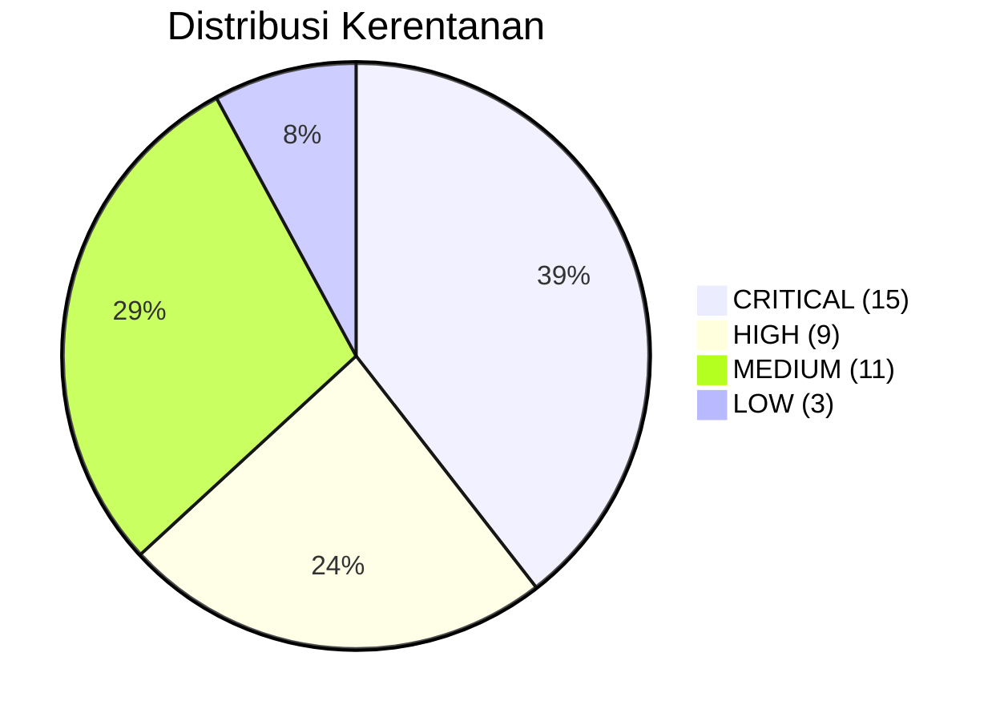
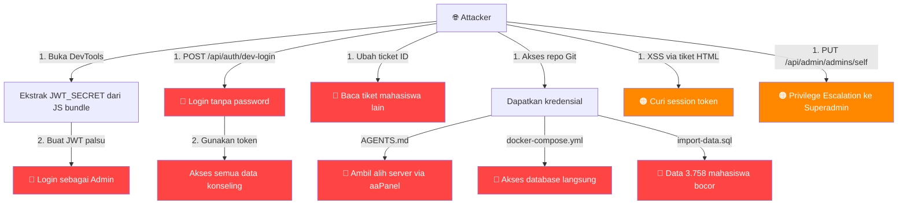

# 🔒 Laporan Audit Keamanan — Layanan Konseling UB

**Tanggal Audit**: 13 Juli 2026  
**Cakupan**: Frontend (Next.js), Backend (Go), Infrastruktur & Deployment  
**Auditor**: Antigravity Security Analysis  
**Total File Diaudit**: 40+ files (22 backend, 12+ frontend, 6+ infra/config)

---

## Ringkasan Eksekutif

> [!CAUTION]
> Ditemukan **15 kerentanan CRITICAL**, **9 HIGH**, dan **11 MEDIUM**. Sistem saat ini memiliki celah keamanan **sangat serius** yang memungkinkan **bypass autentikasi total**, **akses data konseling mahasiswa tanpa izin**, **kebocoran data pribadi 3.758 mahasiswa**, dan **pengambilalihan server penuh**. Perbaikan segera sangat diperlukan.

### Skor Risiko Keseluruhan: 🔴 SANGAT TINGGI — DARURAT



---

## 🔴 Temuan CRITICAL (Harus Diperbaiki Segera)

### C1. JWT Secret Ter-hardcode di Frontend (Client-Side)

| Detail | Nilai |
|--------|-------|
| **File** | [api.ts](file:///Users/brummbitio/Documents/Kuliah/peer-conselour-web/peer-conselour-app/src/utils/api.ts#L8) |
| **Kode** | `export const JWT_SECRET = "r4h4s14_jwt_k0ns3l1ng_UB_2025!";` |
| **Dampak** | **Siapapun** bisa memalsukan token JWT dan login sebagai user/admin manapun |

**Penjelasan**: JWT secret key diekspos di kode JavaScript yang dikirim ke browser. Attacker hanya perlu membuka DevTools → Sources → cari string ini → buat token JWT palsu dengan payload admin. **Ini adalah kerentanan paling kritis** karena memungkinkan impersonasi total.

**Rekomendasi**:
- Hapus `JWT_SECRET` dari kode frontend sepenuhnya
- JWT verification harus **hanya dilakukan di backend**
- Frontend cukup mengirim token, backend yang memvalidasi
- Ganti JWT secret saat ini karena sudah terekspos

---

### C2. OAuth Client Secret di Kode Frontend

| Detail | Nilai |
|--------|-------|
| **File** | [api.ts](file:///Users/brummbitio/Documents/Kuliah/peer-conselour-web/peer-conselour-app/src/utils/api.ts#L11) |
| **Kode** | `const IAM_CLIENT_SECRET = "miYcc3322qb8qRAFW5YLgGg1x3yZEgxv";` |
| **Dampak** | Kompromi integrasi SSO UB, potensi akses ke sistem IAM |

**Penjelasan**: Client Secret OAuth2 adalah kredensial rahasia yang **tidak boleh** ada di kode client-side. Attacker dapat menggunakan secret ini untuk melakukan code exchange langsung ke IAM UB.

**Rekomendasi**:
- Pindahkan OAuth code exchange ke **backend Go**
- Frontend hanya redirect ke IAM, backend yang handle callback
- Minta Client Secret baru ke tim IAM UB karena yang saat ini sudah bocor

---

### C3. OAuth Code Exchange Dilakukan di Client-Side

| Detail | Nilai |
|--------|-------|
| **File** | [api.ts](file:///Users/brummbitio/Documents/Kuliah/peer-conselour-web/peer-conselour-app/src/utils/api.ts#L78-L130) |
| **Fungsi** | `exchangeCodeForToken()` |
| **Dampak** | Token IAM bisa dicegat, client secret terekspos di network tab |

**Penjelasan**: Proses OAuth2 authorization code → token exchange dilakukan di browser. Ini melanggar spesifikasi OAuth2 dimana code exchange **wajib** dilakukan server-side (confidential client flow).

**Rekomendasi**:
- Implementasikan flow: Frontend redirect → IAM → callback ke Backend → Backend exchange code → Backend buat session/JWT → kirim ke Frontend

---

### C4. Dev-Login Bypass Aktif di Production

| Detail | Nilai |
|--------|-------|
| **File Backend** | [auth_handler.go](file:///Users/brummbitio/Documents/Kuliah/peer-conselour-web/peer-conselour-be/internal/handler/auth_handler.go) |
| **File Frontend** | [api.ts](file:///Users/brummbitio/Documents/Kuliah/peer-conselour-web/peer-conselour-app/src/utils/api.ts#L55-L76) |
| **Route** | `POST /api/auth/dev-login` |
| **Dampak** | **Login sebagai siapapun hanya dengan email, tanpa password** |

**Penjelasan**: Endpoint dev-login **tidak memiliki pengecekan environment**. Artinya di production, siapapun bisa mengirim:

```bash
curl -X POST https://api-konseling.ub.ac.id/api/auth/dev-login \
  -H "Content-Type: application/json" \
  -d '{"email": "admin@ub.ac.id"}'
```

Dan mendapatkan token JWT valid sebagai admin. **Ini adalah bypass autentikasi total.**

**Rekomendasi**:
- Tambahkan environment guard: `if os.Getenv("APP_ENV") != "development" { return }`
- Atau lebih baik: **hapus route ini dari production build**
- Gunakan build tags Go (`//go:build dev`) untuk dev-only code

---

### C5. Tidak Ada Authorization Check — IDOR Vulnerability

| Detail | Nilai |
|--------|-------|
| **File** | [ticket_handler.go](file:///Users/brummbitio/Documents/Kuliah/peer-conselour-web/peer-conselour-be/internal/handler/ticket_handler.go) |
| **Endpoint** | `GET /api/tickets/:id`, `GET /api/tickets/:id/messages` |
| **Dampak** | Mahasiswa A bisa membaca data konseling Mahasiswa B |

**Penjelasan**: Endpoint tiket hanya mengecek apakah user ter-autentikasi, tapi **tidak mengecek apakah tiket tersebut milik user yang meminta**. Seorang mahasiswa bisa mengubah ID tiket di URL dan mengakses seluruh percakapan konseling mahasiswa lain — ini adalah pelanggaran privasi serius mengingat data konseling bersifat sangat sensitif.

**Rekomendasi**:
```go
// Tambahkan di setiap handler tiket:
if user.Role == "mahasiswa" && ticket.UserID != user.ID {
    c.JSON(403, gin.H{"error": "Forbidden"})
    return
}
```

---

### C6. Kredensial Database Production di docker-compose.yml

| Detail | Nilai |
|--------|-------|
| **File** | [docker-compose.yml](file:///Users/brummbitio/Documents/Kuliah/peer-conselour-web/docker-compose.yml) |
| **Kode** | `POSTGRES_PASSWORD: K0ns3l1ng_UB_2025!_Secure` |
| **Dampak** | Akses langsung ke database production |

**Rekomendasi**:
- Gunakan Docker secrets atau environment variable dari host
- Jangan hardcode password di file yang di-commit ke Git

---

### C7. Kredensial Production di .env.example

| Detail | Nilai |
|--------|-------|
| **File** | [.env.example](file:///Users/brummbitio/Documents/Kuliah/peer-conselour-web/peer-conselour-be/.env.example) |
| **Dampak** | File `.env.example` biasanya di-commit ke Git. Ini berisi password production yang identik dengan `.env` |

**Rekomendasi**:
- `.env.example` harus berisi placeholder, bukan value asli
- Contoh: `DB_PASSWORD=your_secure_password_here`

---

### C8. Data PII 3.758 Mahasiswa + Chat Konseling di `import-data.sql` (19.7 MB — COMMITTED KE GIT)

| Detail | Nilai |
|--------|-------|
| **File** | [import-data.sql](file:///Users/brummbitio/Documents/Kuliah/peer-conselour-web/docs/import-data.sql) |
| **Ukuran** | 19.7 MB, 27.012 baris |
| **Dampak** | Kebocoran data pribadi ~3.758 mahasiswa, ~4.576 tiket konseling, ~19.000 pesan chat |

**Penjelasan**: File ini BUKAN file dump mentah (`wp_dzj2w(4).sql` yang 208MB dan ada di `.gitignore`), melainkan file **hasil ekstraksi** yang berisi data migrasi siap-import ke PostgreSQL — dan file ini **TIDAK ada di `.gitignore`**, artinya **sudah ter-commit ke Git**.

**Contoh data sensitif yang ditemukan**:
```sql
-- Email & nomor HP asli mahasiswa:
INSERT INTO users ... VALUES (100023, '215120307111091', 'student@student.ub.ac.id',
  ..., 'Nama Lengkap Mahasiswa', ..., '081291XXXXXX', ...);

-- Isi curhat konseling (sangat personal — kesehatan mental, keluarga, keuangan):
INSERT INTO ticket_messages ... VALUES (..., '[isi percakapan konseling sensitif]', ...);
```

> [!CAUTION]
> Ini merupakan **pelanggaran UU PDP (Perlindungan Data Pribadi)** yang serius. Data konseling psikologis termasuk **data sensitif** menurut UU No. 27 Tahun 2022 Pasal 4. Jika repo ini pernah dibagikan (bahkan secara privat), seluruh riwayat konseling mahasiswa terekspos.

**Rekomendasi**:
- Tambahkan `docs/import-data.sql` dan `*.sql` ke `.gitignore`
- Gunakan `BFG Repo-Cleaner` untuk menghapus dari seluruh Git history
- Simpan file migrasi di encrypted storage terpisah, BUKAN di repo kode

---

### C9. SQL Dump 208MB dalam Repository

| Detail | Nilai |
|--------|-------|
| **File** | [wp_dzj2w(4).sql](file:///Users/brummbitio/Documents/Kuliah/peer-conselour-web/wp_dzj2w(4).sql) |
| **Ukuran** | 208 MB |
| **Dampak** | Database dump osTicket lengkap |

**Catatan**: File ini ada di `.gitignore`, namun jika sudah pernah ter-commit sebelumnya, data tetap ada di git history.

---

### C10. Kredensial aaPanel Server di AGENTS.md

| Detail | Nilai |
|--------|-------|
| **File** | [AGENTS.md](file:///Users/brummbitio/Documents/Kuliah/peer-conselour-web/.agents/AGENTS.md) |
| **Kode** | `Host: panel-konseling.ub.ac.id/2kv8tq2z`, `Username: be6h5uk6`, `Password: 3vh7bl3v` |
| **Dampak** | **Pengambilalihan server penuh** — akses panel manajemen server |

**Penjelasan**: Kredensial login panel manajemen server (aaPanel) ada di file AGENTS.md yang kemungkinan besar ter-commit ke Git. Siapapun yang punya akses repository bisa login ke panel server dan mengambil alih seluruh infrastruktur.

**Rekomendasi**:
- Hapus kredensial dari AGENTS.md segera
- Ganti password aaPanel
- Simpan kredensial di password manager (bukan di kode/dokumen)

---

### C10. OAuth Client Secret di AGENTS.md

| Detail | Nilai |
|--------|-------|
| **File** | [AGENTS.md](file:///Users/brummbitio/Documents/Kuliah/peer-conselour-web/.agents/AGENTS.md) |
| **Kode** | `Client Secret: miYcc3322qb8qRAFW5YLgGg1x3yZEgxv` |
| **Dampak** | Kompromi SSO UB |

---

### C11. .gitignore Tidak Memadai

| Detail | Nilai |
|--------|-------|
| **File** | [.gitignore](file:///Users/brummbitio/Documents/Kuliah/peer-conselour-web/.gitignore) |
| **Dampak** | File-file sensitif berpotensi ter-commit ke Git |

**File yang TIDAK ter-exclude**:
- `docker-compose.yml` (password DB)
- `.env.example` (kredensial production)
- `*.sql` (data mahasiswa 208MB)
- `*.zip` (deployment packages)
- `.agents/AGENTS.md` (kredensial server & OAuth)

**Rekomendasi .gitignore yang diperbaiki**:
```gitignore
# Dependencies
node_modules/
.next/

# Environment
.env
.env.local
.env.production
.env.example

# Sensitive data
*.sql
*.zip
docker-compose.yml

# OS
.DS_Store
```

---

### C14. Port Database & MinIO Terekspos + Docker Host Network Mode

| Detail | Nilai |
|--------|-------|
| **File** | [docker-compose.yml](file:///Users/brummbitio/Documents/Kuliah/peer-conselour-web/docker-compose.yml) |
| **Ports** | PostgreSQL `5432`, MinIO `9000`, MinIO Console `9001` |
| **Konfigurasi** | `network_mode: "host"` pada backend container |
| **Dampak** | Akses langsung database & file storage dari jaringan. Backend container berbagi network namespace dengan host tanpa isolasi |

**Rekomendasi**:
- Bind hanya ke localhost: `"127.0.0.1:5432:5432"`
- Gunakan Docker network internal, hapus `network_mode: host`
- Gunakan Docker Compose network bridge untuk komunikasi antar container

---

### C15. APP_ENV Default = "development" — Dev-Login Aktif Jika Lupa Set Env Var

| Detail | Nilai |
|--------|-------|
| **File** | [config.go](file:///Users/brummbitio/Documents/Kuliah/peer-conselour-web/peer-conselour-be/config/config.go#L63) |
| **Kode** | `Env: getEnv("APP_ENV", "development")` |
| **Dampak** | Jika `APP_ENV` tidak di-set di server production (variabel ini **TIDAK ADA di file `.env`!**), default "development" membuat dev-login bypass aktif |

**Penjelasan**: Ini memperkuat temuan C4. Variabel `APP_ENV` yang mengontrol apakah dev-login aktif **tidak ada di `.env`** manapun. Artinya kecuali admin secara manual menambahkan `APP_ENV=production` di server, dev-login bypass **pasti aktif** di production.

**Rekomendasi**:
- Default harus `"production"`, bukan `"development"`
- Atau lebih baik: hapus route dev-login dari production build sepenuhnya

---

## 🟠 Temuan HIGH

### H1. Token Disimpan di localStorage

| Detail | Nilai |
|--------|-------|
| **File** | [api.ts](file:///Users/brummbitio/Documents/Kuliah/peer-conselour-web/peer-conselour-app/src/utils/api.ts#L23) |
| **Kode** | `localStorage.getItem("auth_token")` |
| **Dampak** | Token bisa dicuri via XSS |

**Rekomendasi**: Gunakan `httpOnly` cookie yang diset oleh backend.

---

### H2. dangerouslySetInnerHTML Tanpa Sanitasi (Stored XSS)

| Detail | Nilai |
|--------|-------|
| **Komponen** | [TicketDetailClient.tsx](file:///Users/brummbitio/Documents/Kuliah/peer-conselour-web/peer-conselour-app/app/tickets/%5Bid%5D/TicketDetailClient.tsx#L682-L693) |
| **Kode** | `dangerouslySetInnerHTML={{ __html: body }}` — tanpa sanitasi |
| **Dampak** | Eksekusi JavaScript berbahaya dari data tiket migrasi |

**Penjelasan**: Pesan chat dari osTicket lama (format HTML) dirender langsung tanpa sanitasi. Jika ada konten HTML berbahaya di data migrasi, ini menjadi **Stored XSS** — script berbahaya akan dieksekusi setiap kali halaman tiket dibuka.

**Rekomendasi**: 
```bash
npm install dompurify @types/dompurify
```
```typescript
import DOMPurify from 'dompurify';
// ...
dangerouslySetInnerHTML={{ __html: DOMPurify.sanitize(message.body) }}
```

---

### H3. Tidak Ada Security Headers

| Detail | Nilai |
|--------|-------|
| **File** | [next.config.mjs](file:///Users/brummbitio/Documents/Kuliah/peer-conselour-web/peer-conselour-app/next.config.mjs) |
| **Dampak** | Rentan terhadap XSS, clickjacking, MIME sniffing |

**Header yang hilang**:
- `Content-Security-Policy`
- `X-Frame-Options`
- `X-Content-Type-Options`
- `Strict-Transport-Security`
- `Referrer-Policy`

---

### H4. CORS AllowAll dengan Credentials

| Detail | Nilai |
|--------|-------|
| **File** | [cors_middleware.go](file:///Users/brummbitio/Documents/Kuliah/peer-conselour-web/peer-conselour-be/middleware/cors_middleware.go#L12-L13) |
| **Kode** | `Access-Control-Allow-Origin: *` + `Access-Control-Allow-Credentials: true` |
| **Dampak** | Website manapun bisa membuat request ter-autentikasi ke API |

**Rekomendasi**: Ganti `*` dengan daftar domain yang diizinkan:
```go
AllowOrigins: []string{
    "https://dev-konseling.ub.ac.id",
    "https://konseling.ub.ac.id",
}
```

---

### H5. MinIO Menggunakan Kredensial Default

| Detail | Nilai |
|--------|-------|
| **File** | [.env](file:///Users/brummbitio/Documents/Kuliah/peer-conselour-web/peer-conselour-be/.env) & [docker-compose.yml](file:///Users/brummbitio/Documents/Kuliah/peer-conselour-web/docker-compose.yml) |
| **Kode** | `MINIO_ROOT_USER: minioadmin / MINIO_ROOT_PASSWORD: minioadmin` |
| **Dampak** | Akses penuh ke semua file lampiran konseling |

---

### H6. Wildcard Image Remote Patterns

| Detail | Nilai |
|--------|-------|
| **File** | [next.config.mjs](file:///Users/brummbitio/Documents/Kuliah/peer-conselour-web/peer-conselour-app/next.config.mjs) |
| **Kode** | `hostname: "**"` |
| **Dampak** | Potensi SSRF — Next.js Image Optimization bisa digunakan sebagai proxy |

---

### H7. Admin Privilege Escalation — Admin Bisa Jadikan Diri Superadmin

| Detail | Nilai |
|--------|-------|
| **File** | [user_handler.go](file:///Users/brummbitio/Documents/Kuliah/peer-conselour-web/peer-conselour-be/internal/handler/user_handler.go#L136-L174) |
| **Kode** | `admin.Role = model.UserRole(req.Role)` — tanpa validasi role |
| **Dampak** | Admin biasa bisa mengubah role diri sendiri atau admin lain menjadi `superadmin` |

**Penjelasan**: Endpoint update admin (`PUT /api/admin/admins/:id`) hanya dilindungi oleh `AdminOnly()` middleware yang menerima **baik** `admin` **maupun** `superadmin`. Tidak ada validasi bahwa:
1. Field `role` berisi nilai enum yang valid
2. Hanya superadmin yang boleh mengubah role
3. User tidak bisa mengubah role diri sendiri

**Endpoint lain yang seharusnya superadmin-only**:
- `POST /api/admin/admins` — membuat akun admin baru
- `POST /api/admin/admins/:id/reset-password` — reset password admin lain

---

### H8. OAuth State Parameter Statis — CSRF Attack

| Detail | Nilai |
|--------|-------|
| **File** | [auth_handler.go](file:///Users/brummbitio/Documents/Kuliah/peer-conselour-web/peer-conselour-be/internal/handler/auth_handler.go#L79) |
| **Kode** | `state=ub-peer-counseling-state` — hardcoded static value |
| **Dampak** | Penyerang bisa memaksa victim login ke akun penyerang (OAuth CSRF) |

**Rekomendasi**: Generate random state per-session, simpan di server session, dan validasi di callback.

---

### H9. Docker Backend Berjalan sebagai Root

| Detail | Nilai |
|--------|-------|
| **File** | [Dockerfile](file:///Users/brummbitio/Documents/Kuliah/peer-conselour-web/peer-conselour-be/Dockerfile#L29) |
| **Kode** | `WORKDIR /root/` — tidak ada `USER` directive |
| **Dampak** | Jika ada RCE vulnerability, penyerang mendapat akses root di container |

**Catatan**: Frontend Dockerfile sudah benar — menggunakan `USER nextjs`.

---

## 🟡 Temuan MEDIUM

| # | Temuan | File | Dampak |
|---|--------|------|--------|
| M1 | Console.log di production | Berbagai file frontend | Kebocoran data di DevTools |
| M2 | User data di localStorage bisa dimanipulasi | [api.ts](file:///Users/brummbitio/Documents/Kuliah/peer-conselour-web/peer-conselour-app/src/utils/api.ts#L128) | Client-side privilege escalation |
| M3 | Error detail internal dikembalikan ke client | [auth_handler.go](file:///Users/brummbitio/Documents/Kuliah/peer-conselour-web/peer-conselour-be/internal/handler/auth_handler.go#L119), [upload_handler.go](file:///Users/brummbitio/Documents/Kuliah/peer-conselour-web/peer-conselour-be/internal/handler/upload_handler.go#L87) | Ekspos detail internal (MinIO host, error DB) |
| M4 | PII mahasiswa di-print ke stdout/logs tanpa redaksi | [auth_handler.go](file:///Users/brummbitio/Documents/Kuliah/peer-conselour-web/peer-conselour-be/internal/handler/auth_handler.go#L312) | Kebocoran PII via server logs |
| M5 | Mock data mungkin mengandung data asli | [mock-data.ts](file:///Users/brummbitio/Documents/Kuliah/peer-conselour-web/peer-conselour-app/app/tickets/mock-data.ts) | Kebocoran PII |
| M6 | Tidak ada token expiration check di client | [api.ts](file:///Users/brummbitio/Documents/Kuliah/peer-conselour-web/peer-conselour-app/src/utils/api.ts) | Token stale |
| M7 | JWT token dikirim lewat URL query parameter saat SSO callback | [auth_handler.go](file:///Users/brummbitio/Documents/Kuliah/peer-conselour-web/peer-conselour-be/internal/handler/auth_handler.go#L255) | Token muncul di browser history, server logs, referrer headers |
| M8 | Tidak ada **rate limiting** di seluruh backend | Semua endpoint | Brute-force login, DoS |
| M9 | Attachment ownership tidak divalidasi saat linking ke tiket | [ticket_handler.go](file:///Users/brummbitio/Documents/Kuliah/peer-conselour-web/peer-conselour-be/internal/handler/ticket_handler.go#L114-L121) | Penyerang bisa "mencuri" attachment user lain |
| M10 | Input text tidak divalidasi panjang/format (Title, Detail, Email, Role) | Multiple handlers | Stored XSS, invalid data |
| M11 | `.env` ter-copy ke Docker build stage via `COPY . .` tanpa `.dockerignore` | [Dockerfile](file:///Users/brummbitio/Documents/Kuliah/peer-conselour-web/peer-conselour-be/Dockerfile#L17) | Secrets di Docker build layer cache |

---

## 📊 Peta Serangan (Attack Surface Map)



---

## 🛡️ Prioritas Perbaikan

### Fase 1 — 🚨 DARURAT (Harus segera, dalam 24 jam)

| # | Aksi | Effort | Dampak jika diabaikan |
|---|------|--------|----------------------|
| 1 | **Nonaktifkan `/api/auth/dev-login`** di production | 10 menit | Siapapun bisa login tanpa password |
| 2 | **Hapus `JWT_SECRET`** dan `IAM_CLIENT_SECRET` dari kode frontend | 30 menit | Token bisa dipalsukan |
| 3 | **Ganti JWT Secret** (yang lama sudah terekspos) | 15 menit | Seluruh token saat ini masih bisa dipakai attacker |
| 4 | **Hapus kredensial** dari AGENTS.md dan migration-plan.md | 10 menit | Server bisa diambil alih |
| 5 | **Ganti password aaPanel** (sudah terekspos) | 10 menit | Server bisa diambil alih |
| 6 | **Update .gitignore** + hapus `import-data.sql` dari Git | 15 menit | Data mahasiswa terus terekspos |
| 7 | **Set `APP_ENV=production`** di server | 5 menit | Dev-login tetap aktif meski handler ada guard |
| 8 | **Ubah default `APP_ENV`** di config.go ke `"production"` | 5 menit | Safety net jika env var lupa di-set |

### Fase 2 — ⚠️ URGENT (Dalam 1 minggu)

| # | Aksi | Effort |
|---|------|--------|
| 9 | Pindahkan **OAuth code exchange ke backend** (hilangkan secret dari FE) | 4-8 jam |
| 10 | Perbaiki **CORS** — whitelist domain spesifik | 30 menit |
| 11 | Tambahkan **DOMPurify** untuk sanitasi HTML | 1-2 jam |
| 12 | Tambahkan **security headers** di next.config.mjs | 1 jam |
| 13 | Ganti **MinIO credentials** dari default | 15 menit |
| 14 | **Clean `.env.example`** — gunakan placeholder, bukan value asli | 15 menit |
| 15 | Tambahkan **superadmin-only middleware** untuk endpoint kritis | 2-4 jam |
| 16 | Implementasi **random OAuth state** parameter | 1-2 jam |
| 17 | Hapus default fallback secrets di **config.go** (panic jika missing) | 1 jam |
| 18 | Validasi **attachment ownership** saat linking ke tiket | 1-2 jam |

### Fase 3 — 📋 PENTING (Dalam 1 bulan)

| # | Aksi | Effort |
|---|------|--------|
| 19 | Migrasi token storage dari **localStorage ke httpOnly cookie** | 1-2 hari |
| 20 | Implementasi **CSP header** yang ketat | 4-8 jam |
| 21 | **Docker hardening** — non-root user, internal networks, `.dockerignore` | 2-4 jam |
| 22 | Hapus **console.log** dari production code | 1-2 jam |
| 23 | Bind **database port** hanya ke localhost | 15 menit |
| 24 | Hapus **SQL dump, ZIP, & secrets** dari git history (`BFG Repo-Cleaner`) | 1-2 jam |
| 25 | Tambahkan **rate limiting** di backend | 2-4 jam |
| 26 | Tambahkan **input validation** (panjang, format, enum) di semua handler | 4-8 jam |
| 27 | Hapus **PII logging** (`fmt.Printf` IAM response) di auth_handler | 30 menit |
| 28 | Pindahkan **JWT token dari URL query** ke response body di SSO callback | 2-4 jam |

---

> [!IMPORTANT]
> **Temuan paling kritis**: Kombinasi **JWT secret di frontend** + **dev-login aktif di production** (karena `APP_ENV` default = "development") berarti **siapapun di internet bisa mengakses seluruh data konseling mahasiswa** tanpa memerlukan keahlian hacking apapun.
>
> Cukup satu perintah curl:
> ```bash
> curl https://api-konseling.ub.ac.id/api/auth/dev-login?id=1
> ```
> Untuk mendapatkan **akses admin penuh** ke seluruh sistem.

> [!WARNING]
> **Masalah legal**: File `docs/import-data.sql` yang ter-commit ke Git berisi data pribadi dan riwayat konseling **3.758 mahasiswa asli**. Ini berpotensi melanggar **UU PDP No. 27/2022** dengan ancaman sanksi administratif dan pidana. Segera hapus dari Git history dan lakukan assessment apakah perlu melaporkan insiden data breach.
